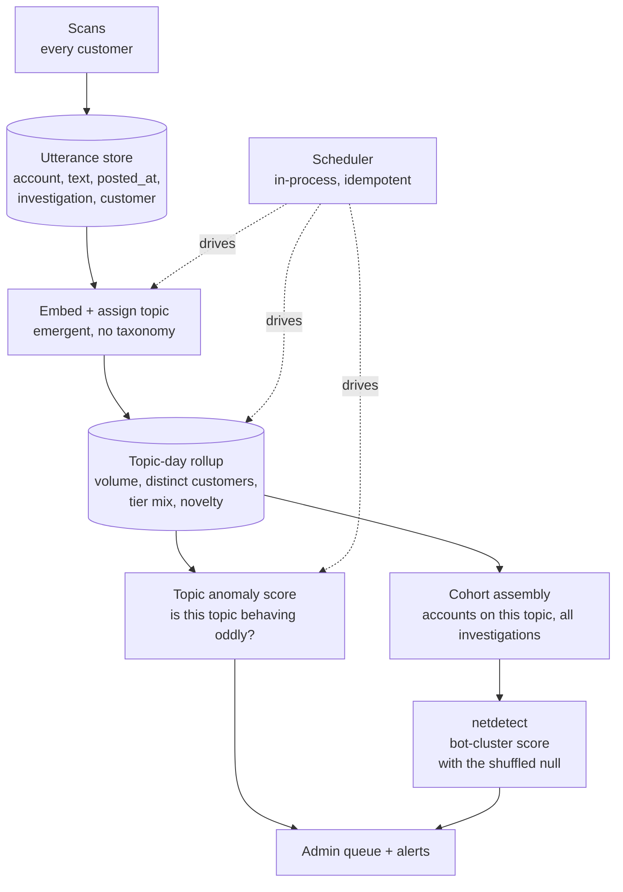

# Narratives across investigations: emergent topics, cross-customer clusters

**Status: design. Nothing built.** Written 2026-08-20.

The ask: stop treating each investigation as an island. Recognise what accounts are TALKING ABOUT
without a hardcoded topic list, notice when the same narrative shows up across investigations run by
different customers, and tell the operator when a topic is anomalous and its accounts look like a
formation.

The worked example, which is an illustration and never a rule in code: three customers each scan a
few posts in one week, all of them about water; many of the accounts score moderate or above; the
system should say *this topic is showing up across unrelated customers and its accounts look
coordinated*, without anyone ever having written "water" anywhere.

---

## 1. Why this is possible here and nowhere else

No single customer can see it. Each one sees their own handful of investigations.

OmiSphere sees every customer's scans in one database. **Cross-customer independence is the whole
signal**, and it is the thing no competitor and no customer can reproduce:

- One customer scanning twelve water posts is *one person's curiosity*. It says nothing.
- Three unrelated customers independently landing on water in one week is *evidence about the world*.

Everything below is built to measure that difference, because measuring it wrong is the difference
between a real finding and an expensive way to rediscover what one user was already interested in.

---

## 2. Emergent topics, never a list

No taxonomy, no keyword file, nothing to maintain. Topics are discovered by clustering what accounts
actually wrote, and a topic's name is derived from its own contents after the fact.

```
utterance ──embed──► nearest centroid ──►  assign, update centroid
                          │
                          └── no match above threshold ──► spawn a new topic
```

This is the incremental online clustering already in `app/narrative/clustering.py`. Two changes it
needs, both currently live defects rather than new work:

- **Real embeddings.** Production installs `[youtube,postgres]`, so `get_embedder()` falls back to
  `HashingEmbedder`, whose own docstring says it "will NOT catch paraphrases". Today "same topic"
  means "same words", and two accounts pushing one narrative in different phrasing do not cluster.
  That is precisely the case this feature exists to catch.
- **Real post timestamps.** `ingest_batch` writes `observed_at=now`, the SCAN time. Every temporal
  statistic over that column currently measures the scanner, and every member of one scan is a
  perfect burst by construction.

A topic gets a human-readable label from its most central utterances. Optionally one model call
names it in a few words; the clustering never depends on that, so a model outage degrades the label
and not the detection.

---

## 3. Architecture



### 3a. The utterance store

One row per `(account, platform, text, posted_at, investigation_id, customer_id, topic_id)`.
Append-only, extracted from `payload_json` which already holds all of it. Everything downstream is a
query against this table instead of a scan through blobs.

`customer_id` is the field that makes §1 measurable, and it is used ONLY to count *distinct
customers*. It never appears in an admin view as "who scanned what", because the value is in the
independence, not the identity.

### 3b. The rollup

Per `(topic, day)`: utterances, distinct accounts, **distinct investigations**, **distinct
customers**, tier mix (share at moderate or above), and novelty (share of accounts never previously
seen on this topic).

### 3c. Score one: is this topic anomalous?

Three multiplied components, and each is required.

| Component | Question | Why it is not enough alone |
|---|---|---|
| **Volume spike** | Is this topic busier than its own trailing baseline? | Topics genuinely trend. Volume alone flags every news story. |
| **Tier-mix anomaly** | Is the share of moderate-and-above accounts higher than the corpus base rate? | This is the load-bearing one. A genuinely viral topic recruits a *representative* sample of accounts; a pushed topic recruits a *biased* one. |
| **Cross-customer independence** | How many *unrelated* customers landed here? | One customer's interest is not a finding. This is the part only OmiSphere can compute. |

The tier-mix test is a binomial tail: with `n` accounts on the topic and `k` at moderate or above,
against the corpus rate over a trailing window **excluding the window under test**. Never counting a
cluster in its own background is a rule this codebase has already paid for twice.

### 3d. Score two: is this cohort a bot cluster?

Take every account that appeared on the topic in the window, **across all investigations**, and run
`app/netdetect` on that cohort. That returns a corrected finding with its shuffled-null p-value, its
per-family breakdown, its evidence sentences, and its `needs_adjudication` flag.

The two scores stay separate and are never multiplied. They answer different questions, and
collapsing them would hide the two most interesting cases: a topic that is anomalous but whose
accounts are unrelated (organic outrage, or a news event), and a tight bot cluster on a topic that
is not spiking at all (a slow, patient operation).

### 3e. The scheduler

Reuses the existing `lifespan_monitoring` pattern: an asyncio task inside the API process, gated on
an env var, doing bounded work on an interval. No new service and no new bill.

Every stage is **idempotent and resumable**, keyed on a watermark, because that loop dies on every
deploy and must simply pick up where it stopped rather than redo or skip work.

---

## 4. The confound that has to be handled honestly

**Customers scan what they suspect, so the corpus is not a sample of the platform.**

If a news story makes water topical, several customers scan water posts, and the topic spikes on
*volume* and on *cross-customer independence* without anything being manufactured. Volume and
independence alone would call that astroturfing.

**The tier-mix test is what separates them**, and it is the reason it is not optional: a story that
makes everyone talk about water pulls in ordinary accounts in ordinary proportion. An operation
pushing water pulls in a population that scores differently. One is a topic being *discussed*, the
other is a topic being *worked*.

This does not improve with scale, and every report has to say so: the claim is *anomalous relative
to our own corpus*, never *anomalous on the platform*.

---

## 5. What the operator sees

Admin-only, for the same reason `/campaigns` and `/narratives` already are: this is assembled from
many customers' scans and belongs to none of them.

One queue, ranked, each row carrying:

- the topic's own derived label and a few representative quotes
- the two scores, side by side and never combined
- how many customers, investigations and accounts, and over what window
- the netdetect evidence sentences, each with its denominator so rarity can be checked
- `needs_adjudication` when the evidence cannot separate a formation from a community
- a dismiss action, because **dismissals are the only ground truth this will ever accumulate**

---

## 6. Decisions taken with the owner (2026-08-20)

1. **Embeddings come from an API**, named as a subprocessor. Roughly $0.002 per scan, no
   infrastructure, best quality. Two consequences that are part of the work rather than afterthoughts:
   the privacy policy's subprocessor list has to name the provider before this ships, since this is
   other people's public posts leaving our servers; and the provider stays behind the existing
   `Embedder` protocol so an unconfigured deployment falls back to `HashingEmbedder` rather than
   breaking.

2. **Scope is across ALL customers, admin-only.** This is the version where cross-customer
   independence is the discriminator, and the only version a customer could not build for
   themselves. `customer_id` is used solely to count DISTINCT customers; no admin view answers "who
   scanned what", because the value is in the independence and not in the identity.

3. **Admin queue plus a daily digest.** Findings accumulate in a ranked queue; one email a day
   summarises what is new above threshold. Nothing interrupts, and the queue is where dismissals are
   recorded. **SMTP is not configured on this deployment**, so the digest is inert until it is, and
   must say so rather than silently sending nothing (the same rule the waitlist blast already
   follows).

4. **Retention: 90 days of text, aggregates forever.** Long enough for a seasonal baseline, and the
   rolling counts that drive detection survive the text being dropped. This bounds how much of other
   people's content is held, which is the difference between an answerable data-protection question
   and an awkward one. A finding older than the window keeps its evidence sentences, which were
   written at detection time, but loses the ability to be re-derived from source.

## 7. Build order

1. Real post timestamps in the narrative ingest. Live defect, unblocks everything temporal.
2. Embeddings behind the existing `Embedder` protocol. Falls back to `HashingEmbedder` unconfigured.
3. Utterance store plus a backfill from stored payloads. Read-only, no behaviour change.
4. Topic assignment over the utterance store.
5. The rollup, and **look at it for a week before trusting a threshold.**
6. Score one, the topic anomaly.
7. Score two, netdetect over the cross-investigation cohort.
8. The scheduler that keeps it current.
9. The admin queue, alerts, and dismissals.

Steps 3 to 5 produce numbers an operator can watch before anything is ever reported as a finding.
That ordering is deliberate: thresholds set before anyone has seen the distribution are guesses.

Two items are NOT code and block shipping rather than building: naming the embedding provider in the
privacy policy, and configuring SMTP so the digest can send.
