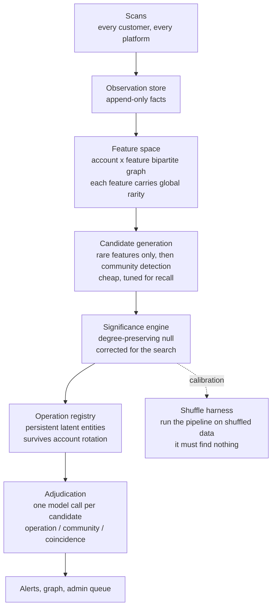

# Coordinated network detection: a ground-up redesign

**Status: design. Supersedes the incremental version.** Written 2026-08-20.

The existing cohort detector is not a network detector that needs extending. It is a *pair scorer*
with a group-assembly step bolted on, and four of its properties are structurally wrong rather than
under-tuned. This document argues that case, then designs the replacement.

---

## 1. Why the current design cannot be fixed by extension

### 1a. It never corrects for the size of the search space

This is the flaw that would embarrass the product if a statistician read the code.

The detector computes a posterior per pair, assembles groups from pairs that clear 0.95, and reports
the groups. But with *N* accounts it is implicitly searching an enormous space of candidate groups,
and it applies **no correction for having searched**. Something improbable is *always* shared by
*some* subset of a large corpus. Reporting the extreme of a large search as though it were a single
pre-registered test is how findings get manufactured.

Every threshold in the system is stated as "P(coordinated) ≥ 0.95." That number is only meaningful
for one hypothesis tested once. The honest quantity is the distribution of the *maximum* score found
over the whole search, and nothing computes it.

### 1b. Pairwise decomposition never asks the group-level question

If twelve accounts share a phrase occurring in one account per ten thousand, the current design sees
66 pairs, takes the strongest edge per family, and requires two independent links to admit a member.
It never asks the actual question: *how improbable is it that twelve accounts in this corpus share
something this rare?*

A set-level statistic cannot be recovered by fusing pairwise ones. The group is **assembled** from
edges rather than **tested** as a group.

### 1c. The 70+ filter inverts the entire value proposition

`cohort.SCORE_THRESHOLD = 70.0`. The detector looks for coordination only among accounts already
flagged as probable bots.

So it finds operations you would have caught anyway, and is blind by construction to the operation
worth catching: aged accounts, hand-written posts, ordinary clients, each scoring 25 to 40 on its
own. The module's own documentation concedes this ("five of the seven signals go quiet").

**Coordination and botness are orthogonal.** `verdict_coordination.py` states this correctly and the
live detector contradicts it. A dense, improbable cluster of *low*-scoring accounts is the single
most valuable thing this product could find, and the filter guarantees it is never looked at.

### 1d. Detection is per-scan; the asset is cross-scan

The unique thing OmiSphere owns is not any detector. It is that every customer's scan feeds one
shared record, so no single customer sees the whole picture and OmiSphere does. That is the moat.

Today detection runs inside one investigation and *writes* to the accumulated graph afterwards. It
is backwards. Detection should run **on** the accumulated graph, with a scan as the event that
updates it.

---

## 2. The reframe

> Not: "score every pair, then cluster the strong ones."
>
> Instead: **"find sets of accounts that share improbably many rare behaviours, and prove the set
> would not appear by chance in a corpus of this shape."**

That is a search problem over a bipartite graph with a multiple-testing correction. It is a
different algorithm, not a tuned version of the current one.

---

## 3. Architecture



Six components. The important structural change is that **detection is a background process over the
global graph**, not a step inside a scan.

### 3a. Observation store

Append-only. One row per fact: `(account, feature, context, observed_at, platform, investigation)`.
Immutable, so a recomputation is always reproducible and a threshold change never rewrites history.

### 3b. Feature space

Every behaviour becomes a **feature token**, and every feature carries a rarity measured over the
whole corpus. The bipartite graph of accounts against features is the substrate everything else
reads.

| Feature class | Example tokens |
|---|---|
| Text | 5-gram shingles, bio shingles, emoji signature, punctuation habits |
| Timing | posting-minute bucket, inter-post gap class, active-hour histogram bucket |
| Network | target post, target author, reply parent |
| Infrastructure | client string, link domain, URL shortener |
| Identity | creation week, handle skeleton, avatar hash class |
| Narrative | topic id, topic-window pair, stated intent |

**Rarity is the whole game.** A feature shared by 30% of the corpus carries no information; one
shared by 0.01% carries almost all of it. Restricting to rare features is simultaneously the
statistical justification and the performance strategy (§6).

### 3c. Candidate generation, tuned for recall

Cheap and deliberately over-inclusive, because the expensive stage below is what removes false
positives:

1. Keep only features below a rarity ceiling.
2. Build the account-account weighted graph over shared rare features. Sparse by construction.
3. Run community detection (`app/graph/algorithms._louvain` already exists and is already wired for
   the saved-graph surface).

### 3d. Significance engine

For each candidate community, the question is: **would a group this dense appear in a corpus of this
shape by chance?**

The null must be **degree-preserving**. Shuffle the account-feature graph while holding each
account's feature count and each feature's account count fixed. This automatically prices in the two
confounds that break naive independence: prolific accounts are prolific in the null too, and popular
features are popular in the null too. It is the principled, general version of the hand-rolled
background subtraction in `verdict_coordination.py`.

Two quantities per candidate:

```
observed   = sum over shared rare features of  -log10 P(this many accounts share it)
                                                under the configuration null
corrected  = observed compared against the distribution of the MAXIMUM observed
             across K degree-preserving shuffles of the whole corpus
```

The correction is the part that does not currently exist anywhere. Comparing against the
distribution of the maximum is exactly the right answer to "I searched a large space and took the
best," and it is the same logic as a permutation test applied to the entire pipeline rather than to
one cluster.

Calibration is amortised: shuffle occasionally to fit a threshold, not per query.

### 3e. Operation registry

An operation is a **latent entity that emits accounts over time**, not a set of accounts.

It holds a *distribution* over the feature space, updated as evidence arrives. A new candidate group
attaches to an existing operation by likelihood under that distribution rather than by an overlap
threshold. Account rotation is then handled by construction: the accounts turn over, the emitting
distribution persists.

This replaces `_match_or_create`'s "member overlap, else signature collision, else create," which
needs a hand-tuned Jaccard floor and a hand-tuned similarity floor precisely because it has no model
of what an operation *is*.

### 3f. Adjudication: the model's real job

**Do not use the model to find networks.** It is weak at combinatorics, and per-account calls do not
scale to a graph.

Use it where it is genuinely better than any algorithm: **one call per candidate group**, reading
the actual posts, answering the question a graph cannot: *is this an operation, or a community?*

A fan community, a professional beat, a diaspora group and a bot network are close to identical in
graph structure. They are obvious to a competent reader. That asymmetry is the argument for putting
the model exactly here and nowhere else, and it costs one call per finding rather than one per
account.

The analyst's existing output also feeds §3b directly: the protocol forces a verbatim quote into
every claim about what an account wrote, and those quotes are pre-selected as *characteristic*,
which makes them better feature material than a raw comment corpus full of "great video".

**The separation still holds.** The engine sends the analyst an evidence bundle and nothing else. All
of this consumes the analyst's output downstream. Nothing here may reach what the model sees when
scoring an account, or the anchoring the protocol forbids arrives by the back door.

---

## 4. Signals nobody is using, and each is cheap

Five ideas that fall out of the reframe and need no new data collection.

**Correlated death.** An operation has a budget. Accounts are bought in batches, used, and retired
together. Correlated *birth* is already measured (`provisioning_window`); correlated **silence** is
not measured at all, and it is just as improbable. An account going quiet is observable in
accumulated history for free.

**Negative space.** Every current signal looks for shared presence. Absence discriminates: real
communities *talk to each other*. A cluster with identical topic timing and **zero internal
conversation** is a broadcast array, and it is more suspicious than one with internal replies, not
less. Nothing looks at this.

**The impossible schedule, measured across accumulated history.** Humans sleep. `_timing_stats`
already computes rhythm, but per scan on 20 to 50 posts. The same statistic over *all* of an
account's observed activity across every scan it has ever appeared in is far stronger, and the data
is already stored.

**Customer scan choices as a prior.** Customers scan posts they suspect. A topic many customers
*independently* choose to scan is a topic where manipulation is suspected by people with context.
Free, crowd-sourced targeting for where to look first. It is a prior on search order only, never
evidence, because it is exactly the selection bias described in §7.

**Seeded calibration.** `tracking/seeds.py` already ingests documented operations from public
disclosure archives, but only to *match* against. Those same seeds are the only labelled positives
that will ever exist, and they should be driving **calibration and recall measurement**, which
CLAUDE.md currently concedes is not measurable at all.

---

## 5. How we would know it works

The current suite proves silence on clean scenarios, which is real but is only half the question. It
concedes recall "is not measurable from this corpus at all."

Three tests the redesign makes possible:

1. **The shuffle test.** Run the entire pipeline on degree-preserving-shuffled data. **If it reports
   anything, the pipeline is manufacturing findings.** This is a hard, honest self-check the current
   design cannot perform, and it should run in CI.
2. **Seeded recall.** Inject the disclosure-archive operations into a synthetic corpus at varying
   dilution and measure the detection rate. This turns recall from unmeasurable into a number.
3. **Dilution curve.** Vary how well-run the injected operation is (aged accounts, hand-written
   posts, ordinary clients) and find where detection fails. That curve *is* the honest product claim,
   and it is the answer to "what can this actually catch."

---

## 6. Scale

Rare-feature restriction is what makes this tractable, and it is not a compromise: common features
carry no signal, so discarding them loses nothing.

At 10^5 to 10^6 accounts, the account-account graph over rare features only is sparse. Louvain is
near-linear in edges. The expensive part is the shuffle calibration, which is amortised: fit a
threshold periodically, not per query.

The one real cost is embeddings for the narrative features, and it is small: a 100-account scan is
roughly 100k tokens, about **$0.002** at commodity embedding pricing. Note production currently
installs `[youtube,postgres]` and therefore runs the lexical `HashingEmbedder`, whose docstring says
it will not catch paraphrases. An embedding API is three orders of magnitude cheaper than putting
torch on the instance.

---

## 7. What it still cannot see, and the bias that does not go away

**The corpus is not a sample of the platform.** We observe accounts customers chose to scan. Every
rate computed here is conditional on that selection, which makes the tests valid *relative to our own
corpus* and invalid as any absolute claim about a platform. This does not improve with scale and must
be stated in every report.

**A slow, disciplined operation stays invisible.** Accounts that post once a week each, on topic, from
aged accounts, with individually written text, share no rare features. No amount of statistics
recovers a signal that was never emitted.

**Community and operation are genuinely ambiguous in graph structure.** §3f puts a reader on that
question because it cannot be resolved statistically, and the failure mode of getting it wrong is
this product publishing an accusation about a real community.

---

## 8. Build order

Each step is independently useful, and the early ones fix live defects.

| | Step | Why here |
|---|---|---|
| 1 | Real post timestamps in the narrative ingest | `ingest_batch` writes `observed_at=now`, so every temporal signal in that layer currently measures the scanner. Live defect. |
| 2 | Embeddings behind the existing `Embedder` protocol, via API | Unblocks semantic topic. Falls back to `HashingEmbedder` when unconfigured. |
| 3 | Observation store + feature extraction, backfilled from stored payloads | Read-only. No behaviour change. Makes everything queryable. |
| 4 | Rarity index + candidate generation | Produces candidates for inspection only. Nothing published. |
| 5 | **Shuffle harness** | Before any threshold is trusted. It is the test that tells you whether the rest is real. |
| 6 | Significance engine with the search correction | The detector. |
| 7 | Operation registry | Replaces overlap-matching with a likelihood model. |
| 8 | Adjudication + surfaces | One model call per candidate. |
| 9 | Seeded recall + dilution curve | Turns the product claim into a measured number. |

**Step 5 before step 6 is deliberate.** Building the detector before the test that can falsify it is
how a system ends up confidently reporting noise, and this product's findings are published claims
about named real people.

---

## 9. What happens to the current detector

It keeps running. It is precise on the operations it can see, its precision suite is real, and
turning it off would remove a working feature to replace it with an unproven one.

The redesign runs **beside** it over the global graph. When the shuffle test and the dilution curve
say the new path is at least as trustworthy, the old one becomes one more feature class inside it:
its seven signals are good features, they were simply asked the wrong question.
